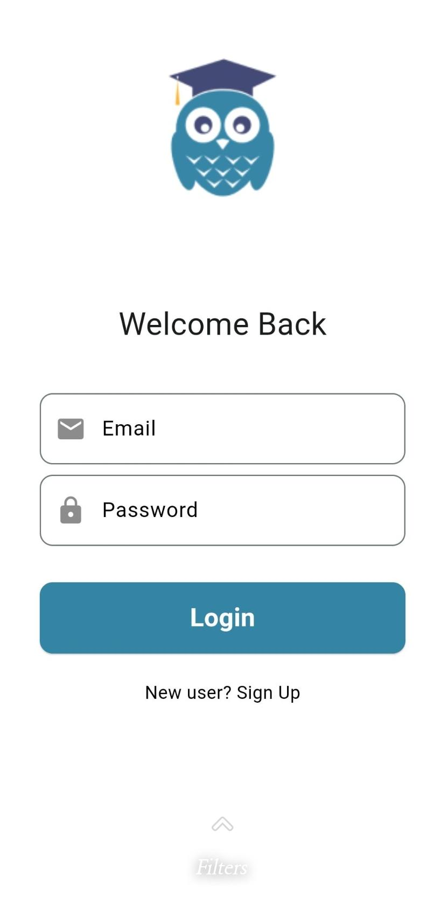
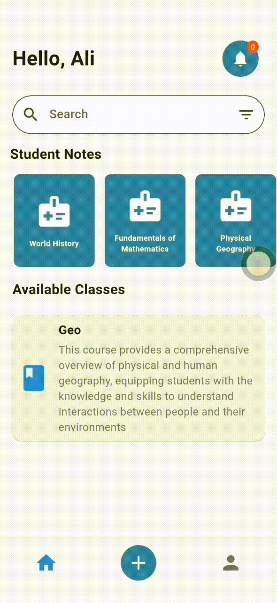
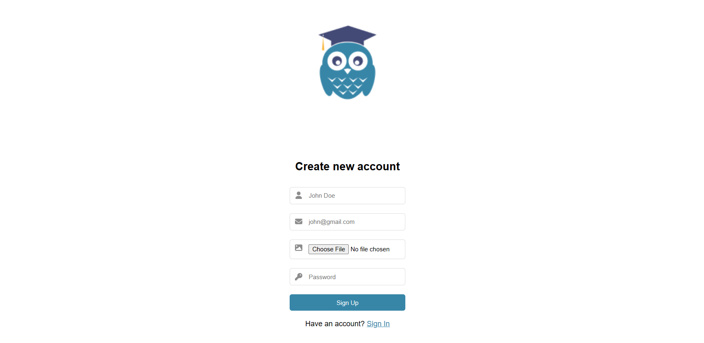
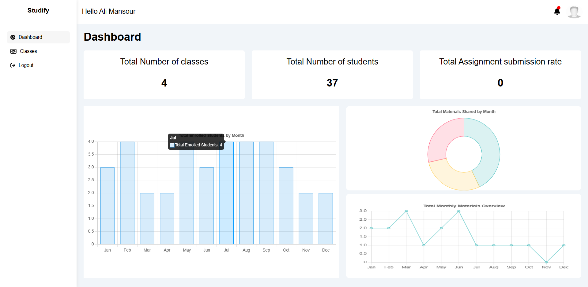
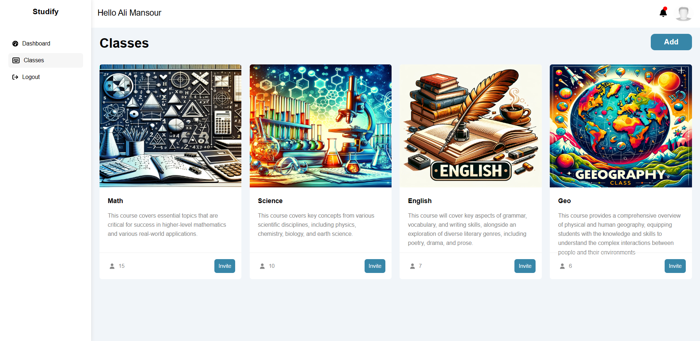
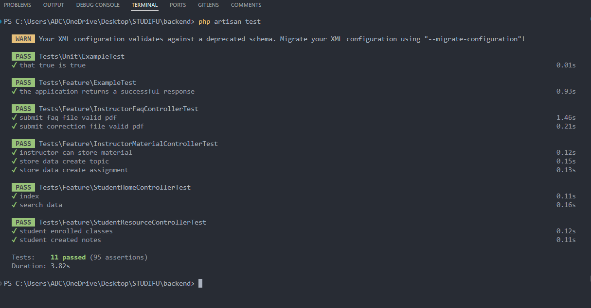

<br><br>

<!-- project philosophy -->


> Studify: A mobile app designed to improve student learning by making it easy to share and access study materials. Our goal is to help students and teachers connect and learn better through technology.
>
> Studify helps students learn more by providing a simple way for teachers to upload study materials, including PDFs with questions and answers. Students can find and use these materials, ask questions, and get answers based on the content. The app encourages students to share materials. Using technology like OpenAI and Firebase, Studify makes communication fast and learning more effective for everyone.

### User Stories

- As a student, I want to share my study materials and summaries , so other students can benefit.
- As a student, I want to be able to search for and access materials related to my courses so that I can study and prepare for exams more effectively.
- As a student, I want to receive notifications about new materials and assignments so that I can keep up-to-date with my course requirements.
- As a student, I want to ask questions related to the PDF materials and receive instant answers so that I can clarify doubts without waiting.
- As an instructor, I want to view statistics on material usage and student engagement so that I can adjust my teaching strategies accordingly.
- As an instructor, I want to be able to create topics within a material so that I can organize course content in a structured manner.

<br><br>

<!-- Tech stack -->


### Studify is built using the following technologies:

- This project uses the [Flutter app development framework](https://flutter.dev/). Flutter is a cross-platform hybrid app development platform which allows us to use a single codebase for apps on mobile, desktop, and the web.
- The backend database uses [PostgreSQL](https://www.postgresql.org/), a powerful, open-source object-relational database system known for its robustness, performance, and standards compliance.
- Notifications within the app are managed through [Firebase](https://firebase.google.com/), specifically Firebase Cloud Messaging. This service allows for reliable and scalable delivery of notifications to devices across platforms.
- 🚨 Currently, notifications aren't working on macOS.

<br><br>

<!-- UI UX -->


> We designed Studify using wireframes and mockups, iterating on the design until we reached the ideal layout for easy navigation and a seamless user experience.

- Project Figma design [Figma](https://www.figma.com/file/gY2RkjNNiUb3fWZdRxAb3B/Final-Project?type=design&node-id=0%3A1&mode=design&t=H9cFcGzmbFVlpID6-1)

### Mockups

| Register screen                          | Category Screen                         | Home Screen                              |
| ---------------------------------------- | --------------------------------------- | ---------------------------------------- |
|  |  |  |

<br><br>

<!-- Database Design -->


### Architecting Data Excellence: Innovative Database Design Strategies:


<br><br>

<!-- Implementation -->


### User Screens (Mobile)

| Login screen                              | Register screen                         | Home screen                          | Camera screen                          |
| ----------------------------------------- | --------------------------------------- | --------------------------------------- | --------------------------------------- |
|  |  |  |  |
| Home screen                               | Menu Screen                             | Order Screen                            | Checkout Screen                         |
|  |  |  |  |

### Instructor Screens (Web)

| Register screen                           | Home screen                         | Classes screen                            |
| ----------------------------------------- | ----------------------------------- | ----------------------------------------- |
|  |  |  |

<br><br>

<!-- Prompt Engineering -->


### Enhancing Learning with Advanced AI: Mastering Prompt Engineering

- This project uses  advanced AI and prompt engineering to optimize interactions with NLP models, ensuring accurate answers and concise study materials. By integrating OpenAI's GPT with Laravel and Flask servers, the platform efficiently processes and manages educational content, providing a seamless learning experience for students.

<br><br>

<!-- AWS Deployment -->


###  Maximizing AI Potential: Efficient AWS Integration and Deployment

- This project leverages AWS deployment strategies to seamlessly integrate and deploy natural language processing models. With a focus on scalability, reliability, and performance, we ensure that AI applications powered by these models deliver robust and responsive solutions for diverse use cases.

<br><br>

<!-- Unit Testing -->


### Ensuring Accuracy: The Power of Precision Unit Testing

- This project employs rigorous unit testing methodologies to ensure the reliability and accuracy of code components. By systematically evaluating individual units of the software, we guarantee a robust foundation, identifying and addressing potential issues early in the development process.


<br><br>

<!-- How to run -->


> To set up Studify locally, follow these steps:

### Prerequisites

This is an example of how to list things you need to use the software and how to install them.

- npm
  ```sh
  npm install npm@latest -g
  ```

### Installation

_Below is an example of how you can instruct your audience on installing and setting up your app. This template doesn't rely on any external dependencies or services._

1. Obtain a free API Key by registering at [Firebase](https://firebase.google.com/)
2. Clone the repo
   git clone [github](https://github.com/ali-mansour21/Studify-App)
3. Install NPM packages
   ```sh
   cd frontend
   npm install
   ```
4. Install Flutter dependencies for the mobile application
   ```sh
   cd mobile
   flutter pub get
   ```
5. Enter your Firebase API key in the configuration file for the mobile app
   ```sh
   const FIREBASE_API_KEY = "ENTER YOUR FIREBASE API";
   ```
6. Enter your API in `config.js`
   ```js
   const API_KEY = "ENTER YOUR FIREBASE API";
   ```

With these steps, you should be able to run Studify on both mobile and web platforms locally and explore its features.
